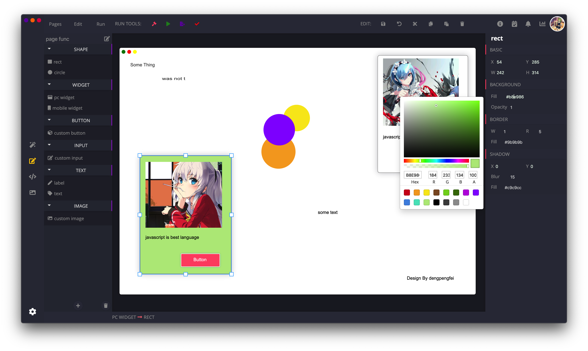

# Magic ui

#### 使用WebGL实现的一个拖拽式UI代码生成App

#### 运行
+ 开发模式运行
```bash
npm run start-dev
```
+ 生产模式运行
```bash
npm run build && npm run start
```

+ 打包
```bash
npm run package-mac
```
更多请参考```package.json```

#### 服务端
